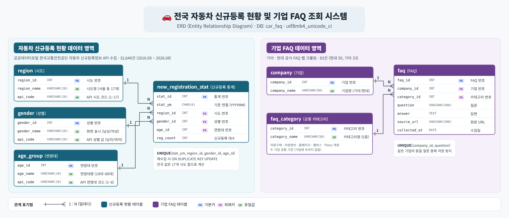
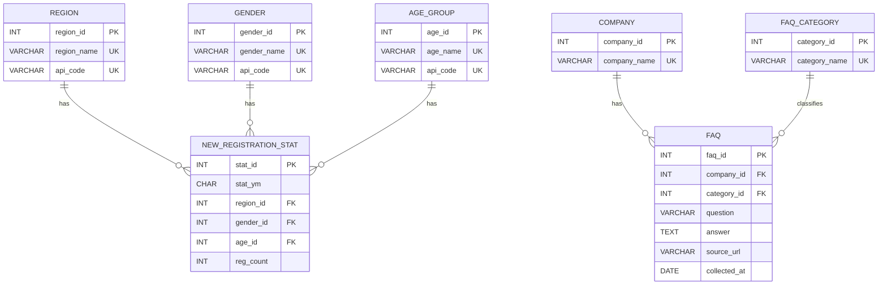

# DB 설계서

## 전국 자동차 신규등록 현황 및 기업 FAQ 조회 시스템

> SK Networks Family AI CAMP 37기 1차 프로젝트 · DB/ERD 설계 문서 (최종)

---

## 1. 데이터베이스 개요

| 항목 | 내용 |
|---|---|
| Database | `car_faq` |
| Character Set | `utf8mb4` (Collation `utf8mb4_unicode_ci`) |
| 목적 | 전국 자동차 신규등록 현황 및 자동차 기업 FAQ 조회 데이터 관리 |
| 데이터 영역 | 자동차 신규등록 현황 / 기업 FAQ |
| 전체 테이블 수 | 7개 |
| 적재 데이터 | 신규등록 32,640건 (2016.09 ~ 2026.08, 120개월) · FAQ 83건 (현대 50건, 기아 33건) |

본 데이터베이스는 크게 **자동차 신규등록 현황**과 **기업 FAQ** 두 영역으로 구성됩니다.
자동차 신규등록 영역은 공공데이터포털 API에서 수집한 신규등록 데이터를 저장하고,
기업 FAQ 영역은 기아·현대의 공식 FAQ를 웹 크롤링하여 저장합니다.

---

## 2. ERD

### 2.1 ERD 전체 구조





### 2.2 관계 요약

#### 자동차 신규등록 현황

- `region` 1 : N `new_registration_stat`
- `gender` 1 : N `new_registration_stat`
- `age_group` 1 : N `new_registration_stat`

`new_registration_stat`은 **연월 + 시도 + 성별 + 연령대** 조합의 신규등록 대수를 저장합니다.

#### 기업 FAQ

- `company` 1 : N `faq`
- `faq_category` 1 : N `faq`

`faq`는 기업과 FAQ 카테고리를 **각각** 외래키로 연결하며, 질문 1개를 1행으로 저장합니다.
카테고리는 특정 기업에 속하지 않는 **두 기업 공통 기준**이므로 `faq_category`와 `company` 사이에는 관계가 없습니다.

두 데이터 영역 사이에는 직접적인 테이블 관계가 없습니다.

### 2.3 설계 포인트

- **코드 테이블에 `api_code` 분리**: 화면 표기(예: 남성)와 API 요구값(예: 남자)이 달라 별도 컬럼으로 관리
- **전국 합계 미저장**: 전국 값은 17개 시도의 합으로 계산 · 중복 저장 방지
- **중복 방지**: 신규등록은 연월·시도·성별·연령대 조합, FAQ는 기업·질문 조합에 UNIQUE 제약
- **참조 무결성**: 모든 외래키에 `FOREIGN KEY` 제약 선언 · 참조 중인 기준 데이터는 삭제 불가
- **공통 카테고리**: 기업마다 다른 FAQ 탭 이름을 공통 카테고리 5종으로 통일해 두 기업을 같은 기준으로 조회

---

## 3. 테이블 구성

| 영역 | 테이블 | 역할 |
|---|---|---|
| 신규등록 | `region` | 시도 목록 및 API 코드 관리 |
| 신규등록 | `gender` | 성별 목록 및 API 코드 관리 |
| 신규등록 | `age_group` | 연령대 목록 및 API 코드 관리 |
| 신규등록 | `new_registration_stat` | 신규등록 대수 저장 |
| FAQ | `company` | FAQ 대상 기업 관리 |
| FAQ | `faq_category` | 공통 FAQ 카테고리 관리 |
| FAQ | `faq` | 질문·답변·출처·수집일 저장 |

---

# 4. 테이블 정의서

## 4.1 `region` — 시도

시도 선택 목록을 저장하고, 신규등록 API 요청 시 사용할 지역 코드도 함께 관리합니다.

| 컬럼 | 타입 | 제약 | 설명 |
|---|---|---|---|
| `region_id` | INT | PK, AUTO_INCREMENT | 시도 번호 |
| `region_name` | VARCHAR(20) | NOT NULL, UNIQUE | 화면 표시 이름 (예: 서울, 부산) · 17개 |
| `api_code` | VARCHAR(10) | UNIQUE | API 요청 변수 `registGrcCode` 값 · `'1'` ~ `'17'` |

---

## 4.2 `gender` — 성별

성별 선택 목록을 저장하고 API 요청 코드와 연결합니다.

| 컬럼 | 타입 | 제약 | 설명 |
|---|---|---|---|
| `gender_id` | INT | PK, AUTO_INCREMENT | 성별 번호 |
| `gender_name` | VARCHAR(10) | NOT NULL, UNIQUE | 화면 표시 이름 (남성, 여성) |
| `api_code` | VARCHAR(10) | UNIQUE | API 요청 변수 `sexdstn` 값 (남자, 여자) |

---

## 4.3 `age_group` — 연령대

연령대 선택 목록을 저장하고 API 요청 코드와 연결합니다.

| 컬럼 | 타입 | 제약 | 설명 |
|---|---|---|---|
| `age_id` | INT | PK, AUTO_INCREMENT | 연령대 번호 |
| `age_name` | VARCHAR(10) | NOT NULL, UNIQUE | 10대 ~ 80대 · 8개 |
| `api_code` | VARCHAR(10) | UNIQUE | API 요청 변수 `agrde` 값 · `'1'` ~ `'8'` |

화면 표시 순서는 기준 데이터 입력 순서를 따릅니다.

---

## 4.4 `new_registration_stat` — 신규등록 통계

공공데이터포털 신규등록정보 API에서 수집한 신규등록 대수를 저장하는 핵심 테이블입니다.

**연월 + 시도 + 성별 + 연령대 1조합 = 1행**으로 관리합니다.

| 컬럼 | 타입 | 제약 | 설명 |
|---|---|---|---|
| `stat_id` | INT | PK, AUTO_INCREMENT | 통계 번호 |
| `stat_ym` | CHAR(6) | NOT NULL | 기준 연월 (예: `202608`) |
| `region_id` | INT | FK, NOT NULL | `region.region_id` 참조 |
| `gender_id` | INT | FK, NOT NULL | `gender.gender_id` 참조 |
| `age_id` | INT | FK, NOT NULL | `age_group.age_id` 참조 |
| `reg_count` | INT | NOT NULL | 신규등록 대수 (단위: 대) |

### 복합 유일 조건

```text
UNIQUE(stat_ym, region_id, gender_id, age_id)
```

동일 연월·시도·성별·연령대 조합의 중복 저장을 방지하고, 재수집 시 `ON DUPLICATE KEY UPDATE`로 기존 값을 갱신합니다.

전국 값은 저장하지 않고 17개 시도의 합으로 계산합니다.

---

## 4.5 `company` — 기업

FAQ를 수집하는 자동차 기업 목록을 관리합니다.

현재 대상 기업은 **기아, 현대**입니다.

| 컬럼 | 타입 | 제약 | 설명 |
|---|---|---|---|
| `company_id` | INT | PK, AUTO_INCREMENT | 기업 번호 |
| `company_name` | VARCHAR(50) | NOT NULL, UNIQUE | 기업명 (기아, 현대) |

기업이 추가되는 경우 `company`에 행을 추가하는 방식으로 확장합니다.

---

## 4.6 `faq_category` — FAQ 카테고리

기아와 현대의 FAQ를 공통 기준으로 조회하기 위한 카테고리 테이블입니다.
특정 기업에 속하지 않으며, 두 기업이 같은 카테고리 행을 함께 사용합니다.

| 컬럼 | 타입 | 제약 | 설명 |
|---|---|---|---|
| `category_id` | INT | PK, AUTO_INCREMENT | 카테고리 번호 |
| `category_name` | VARCHAR(50) | NOT NULL, UNIQUE | 공통 FAQ 카테고리 (`03_seed.sql`로 추가) |

### 공통 카테고리 5종

| 공통 카테고리 | 기아 탭 | 현대 탭 |
|---|---|---|
| 차량구매 | 차량 구매 | 차량구매 |
| 차량정비 | 차량 정비 | 차량정비 |
| 홈페이지 | 홈페이지 | 홈페이지 |
| 멤버스 | 기아멤버스 | 블루멤버스 |
| Pleos 계정 | Pleos 계정 | Pleos 계정 |

공통 주제만 수집하며, 기업별 기타 탭은 현재 범위에서 제외합니다.

---

## 4.7 `faq` — FAQ

기업 공식 홈페이지에서 크롤링한 FAQ 데이터를 저장합니다.

**질문 1개 = 1행**으로 관리합니다.

| 컬럼 | 타입 | 제약 | 설명 |
|---|---|---|---|
| `faq_id` | INT | PK, AUTO_INCREMENT | FAQ 번호 |
| `company_id` | INT | FK, NOT NULL | `company.company_id` 참조 |
| `category_id` | INT | FK, NOT NULL | `faq_category.category_id` 참조 |
| `question` | VARCHAR(500) | NOT NULL | 질문 |
| `answer` | TEXT | NOT NULL | 답변 |
| `source_url` | VARCHAR(500) | NULL 가능 | 원본 페이지 주소 |
| `collected_at` | DATE | NOT NULL | 수집일 |

### 복합 유일 조건

```text
UNIQUE(company_id, question)
```

같은 기업의 동일 질문이 중복 저장되지 않도록 관리합니다.

---

# 5. 데이터 수집 구조

## 5.1 자동차 신규등록 API

### API Endpoint

```text
GET https://apis.data.go.kr/B553881/newRegistlnfoService_02/getnewRegistlnfoService02
```

- 응답 형식: **XML** (`_type=json` 미지원)
- 호출 1번 = 조건 1조합의 신규등록 대수 1개

### 주요 요청 변수

| 변수 | 저장/참조 위치 | 설명 |
|---|---|---|
| `serviceKey` | `.env` → `MOLIT_API_KEY` | 공공데이터포털 인증키 |
| `registYy` | `stat_ym` 앞 4자리 | 기준 연도 |
| `registMt` | `stat_ym` 뒤 2자리 | 기준 월 |
| `registGrcCode` | `region.api_code` | 시도 코드 |
| `sexdstn` | `gender.api_code` | 성별 코드 |
| `agrde` | `age_group.api_code` | 연령대 코드 |

### 응답 데이터 저장

| API 응답 | DB 저장 위치 |
|---|---|
| `body/dtaCo` | `new_registration_stat.reg_count` |
| 요청 연월 | `new_registration_stat.stat_ym` |
| 요청 시도 | `new_registration_stat.region_id` |
| 요청 성별 | `new_registration_stat.gender_id` |
| 요청 연령대 | `new_registration_stat.age_id` |

응답에는 요청 조건이 다시 오지 않으므로, 요청할 때 사용한 값을 함께 저장합니다.

### 응답 코드 처리

| 상황 | 처리 |
|---|---|
| `resultCode` = `00` | 정상 · `dtaCo` 값 저장 |
| `resultCode` = `03` (NODATA) | 신규등록 0건으로 저장 |
| 그 외 `resultCode` | 오류 출력 후 수집 중단 |
| `resultCode` 태그 없음 | 일일 호출 한도 초과 등으로 다른 형식의 XML 수신 · 수집 중단 |

수집 중단 시에도 그때까지 모은 값은 저장됩니다. 다음 실행 때 **이미 저장된 조합은 건너뛰고** 남은 조합부터 이어서 수집합니다.

### 수집 규모

- 한 달 기준 **17개 시도 × 2개 성별 × 8개 연령대 = 272개 조합**
- 수집 범위: **2016.09 ~ 2026.08 (120개월) · 총 32,640건**
- 일일 호출 한도 10,000회 · 1회 실행 최대 9,900회로 나눠 수집 · 호출 간격 0.2초
- 저장: 500건마다 `execute_many`로 중간 저장 · 끝나면 나머지 저장

---

## 5.2 기업 FAQ 크롤링

```text
기업 공식 FAQ
      ↓
Web Crawling
      ↓
질문 / 답변 / 원본 URL 수집
      ↓
공통 카테고리 분류
      ↓
MySQL 저장
```

| 기업 | 파일 | 방식 |
|---|---|---|
| 현대 | `collectors/crawl_hyundai.py` | Selenium · 카테고리 탭 클릭 → 질문 펼침 → 답변 수집 · 질문 기준 중복 제거 |
| 기아 | `collectors/crawl_kia.py` | Selenium · 카테고리별 최대 15건 · 페이지 이동 수집 · 카테고리 + 질문 기준 중복 제거 |

- 두 크롤러 모두 사이트 탭 이름을 공통 카테고리로 변환 (`CATEGORY_MAP`)
- 적재 결과: 현대 50건, 기아 33건

FAQ 데이터는 `company`, `faq_category`, `faq`를 통해 기업과 카테고리를 연결합니다.

---

# 6. 화면과 데이터베이스 매핑

## 6.1 자동차 신규등록 현황 페이지

**상세 데이터 / 그래프** 두 개의 탭으로 구성됩니다.

| 화면 요소 | 사용 컬럼 | 처리 |
|---|---|---|
| 기간(연월) | `new_registration_stat.stat_ym` | `BETWEEN` 조건 |
| 시도 | `region.region_name` | 선택값을 WHERE 조건으로 사용 |
| 성별 | `gender.gender_name` | 선택값을 WHERE 조건으로 사용 |
| 연령대 | `age_group.age_name` | 선택값을 WHERE 조건으로 사용 |
| 상세 데이터 표 | `reg_count` | 조건에 맞는 행 조회 |
| 합계 | `reg_count` | 조회 결과를 화면에서 합산 |
| CSV 내려받기 | 조회 결과 | `utf-8-sig` 인코딩으로 저장 |
| 그래프 탭 요약 수치 | `reg_count` | 총 신규등록 · 월평균 · 최근 달 전월 대비 · 최다 시도/연령대 |
| 연월별 추이 | `stat_ym`, `reg_count` | 연월별 합계 선 그래프 |
| 연령대별 성별 비교 | `age_name`, `gender_name`, `reg_count` | 묶은 막대 그래프 |
| 성별 비중 | `gender_name`, `reg_count` | 도넛 차트 |

`전체` 선택 시 해당 조건의 WHERE 절을 제외하여 전체 행을 조회합니다.

---

## 6.2 기업 FAQ 조회 페이지

| 화면 요소 | 사용 컬럼 | 처리 |
|---|---|---|
| 기업 선택 | `company.company_name` | 기업 목록 조회 및 필터 |
| 카테고리 선택 | `faq_category.category_name` | 선택한 기업에 FAQ가 있는 카테고리만 목록으로 표시 · `전체` 선택 시 조건 제외 |
| 키워드 검색 | `faq.question`, `faq.answer` | 질문 또는 답변에 `LIKE '%키워드%'` |
| 답변 | `faq.answer` | 질문 클릭 시 표시 |
| 원본 보기 | `faq.source_url` | 원문 링크 제공 |
| 수집일 | `faq.collected_at` | FAQ 메타정보 표시 |
| 결과 목록 | `faq.faq_id` | 최신 등록순 정렬 · 20개씩 표시, 더 보기 |

---

# 7. 애플리케이션과 DB 연결 구조

```text
Streamlit
   │
   ├── 자동차 신규등록 현황
   │        ↓
   │   db/registration.py
   │        ↓
   │   db/connection.py
   │        ↓
   │      MySQL
   │
   └── 기업 FAQ 조회
            ↓
       db/faq.py
            ↓
       db/connection.py
            ↓
          MySQL
```

공통 DB 연결은 `db/connection.py`(`get_connection`, `fetch_df`, `execute_many`)를 사용하며, 화면 코드에 직접 SQL을 작성하지 않습니다.

### 조회 함수

| 파일 | 함수 |
|---|---|
| `db/registration.py` | `get_available_yms`, `get_regions`, `get_genders`, `get_age_groups`, `get_new_registration(start_ym, end_ym, region, gender, age_group)` |
| `db/faq.py` | `get_companies`, `get_categories(company)`, `search_faq(company, category, keyword)` |

화면에서 `전체`를 선택하면 해당 인자를 `None`으로 전달합니다.

---

# 8. 프로젝트 폴더 구조

```text
SKN37-1ST-2TEAM/
│
├── app.py                         # 홈 화면
├── styles.py                      # 공통 스타일 · UI 함수
│
├── pages/
│   ├── 1_자동차_등록_현황.py
│   └── 2_기업_FAQ_조회.py
│
├── db/
│   ├── __init__.py
│   ├── connection.py              # 공통 DB 접속
│   ├── registration.py            # 신규등록 조회 함수
│   └── faq.py                     # FAQ 조회 함수
│
├── collectors/
│   ├── collect_registration.py    # 신규등록 API 수집
│   ├── crawl_kia.py               # 기아 FAQ 크롤링
│   └── crawl_hyundai.py           # 현대 FAQ 크롤링
│
├── sql/
│   ├── 00_init.sql
│   ├── 01_registration.sql
│   ├── 02_faq.sql
│   ├── 03_seed.sql
│   └── 99_migrate_20260922.sql
│
├── dumps/                         # DB 덤프 파일 (car_faq_dump.sql · 전체 데이터)
├── assets/                        # 로고 · 배너 · 일러스트
├── .streamlit/                    # Streamlit 설정
│
├── .env.example
├── .gitignore
├── requirements.txt
└── README.md
```

---

# 9. 공통 DB 규칙

## 명명 규칙

- 테이블 및 컬럼: `snake_case` 영문 소문자
- DB 이름: `car_faq`
- 문자셋: `utf8mb4`

## ID 조회 규칙

자동 증가 ID를 직접 입력하지 않고 이름을 기준으로 조회합니다.

```sql
-- 지양
WHERE company_id = 1

-- 권장
WHERE company_name = '현대'
```

## 중복 처리

### 신규등록

```text
UNIQUE(stat_ym, region_id, gender_id, age_id)
```

재수집 시 `ON DUPLICATE KEY UPDATE` 방식으로 기존 값을 갱신합니다.

### FAQ

```text
UNIQUE(company_id, question)
```

동일 기업의 동일 질문 중복 저장을 방지합니다.

## 환경변수

실제 비밀번호와 API 인증키는 `.env`에 보관합니다.
GitHub에는 값이 비어 있는 `.env.example`만 업로드합니다.

```text
DB_HOST=
DB_PORT=
DB_USER=
DB_PASSWORD=
DB_NAME=
MOLIT_API_KEY=
```

## 덤프 파일

- 파일: `dumps/car_faq_dump.sql` · 7개 테이블 구조 + 전체 데이터 (신규등록 32,640건 · FAQ 83건)
- 생성: 리다이렉션(`>`) 대신 `-r` 옵션 사용 (PowerShell에서 `>` 사용 시 UTF-16으로 저장되어 한글 깨짐)
- DB 생성 명령은 포함되지 않음 → 복원 전 `car_faq` DB 먼저 생성
- 복원: cmd는 `<`, PowerShell은 `source` 사용 (PowerShell은 `<` 미지원)

```text
# 생성
mysqldump -u root -p car_faq -r dumps/car_faq_dump.sql

# 복원 (cmd)
mysql -u root -p car_faq < dumps/car_faq_dump.sql

# 복원 (PowerShell)
mysql -u root -p car_faq -e "source dumps/car_faq_dump.sql"
```

---

# 10. SQL 실행 순서

신규 환경에서는 다음 순서로 실행합니다.

```text
00_init.sql
    ↓
01_registration.sql
    ↓
02_faq.sql
    ↓
03_seed.sql
```

이전 버전(v0.7)의 SQL을 실행한 환경은 `99_migrate_20260922.sql` → `01_registration.sql` → `03_seed.sql` 순서로 실행해 최신 구조를 맞춥니다.

---

# 11. 데이터 영역별 담당

| 영역 | 담당 |
|---|---|
| 자동차 신규등록 현황 API 수집 / DB 공통 모듈 | 강유나 |
| FAQ - 기아 | 박세윤 |
| Web Page | 신지호 |
| FAQ - 현대 | 오원아 |

---

# 12. 설계 요약

```text
[자동차 신규등록]

region ─────────────┐
gender ──────────────┼──> new_registration_stat
age_group ──────────┘

연월 + 시도 + 성별 + 연령대
              ↓
         신규등록 대수


[기업 FAQ]

company ────────────┐
                    ├──> faq
faq_category ───────┘

기업 + 카테고리 + 질문
          ↓
질문 / 답변 / 원본 URL / 수집일
```

본 설계는 프로젝트 기획상의 3개 화면 중 **자동차 신규등록 현황**과 **기업 FAQ 조회** 기능을 데이터베이스에서 지원하기 위한 구조입니다.
